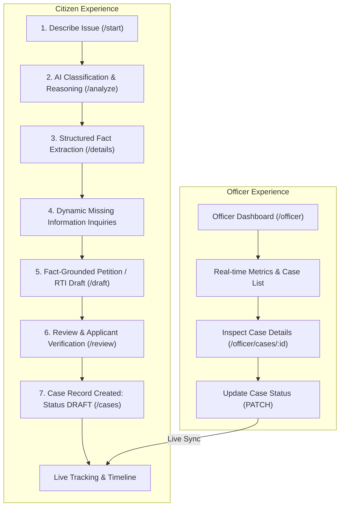

# The Grievance Scribe

> **AI-Assisted Civic Petition & RTI Application Drafting System**

The Grievance Scribe is a civic technology platform designed to empower citizens by transforming informal, plain-language complaints and inquiries into formally structured, legally grounded **Public Grievance Petitions** and **Right to Information (RTI) Applications**.

It features a **Dual-Role Civic Architecture**:
1. **Citizen Portal**: Guided workflow for issue analysis, structured fact extraction, dynamic missing information inquiry, document drafting, verification, and live tracking.
2. **Officer Dashboard**: Administrative workspace for inspecting citizen submissions, reviewing extracted facts and drafted applications, and managing case workflow statuses.

---

## 🏛️ Architecture & Workflow



---

## ✨ Key Features

### 👤 Citizen Experience
- **Intelligent Classification (`/api/analyze`)**: Analyzes citizen input to determine whether the issue is a **Public Grievance** (service failure, infrastructure damage) or an **RTI Request** (seeking official records, tender details, budget logs).
- **Automated Fact Extraction (`/api/extract-facts`)**: Identifies core entities including problem description, precise location, duration, prior complaint history, and authority involved.
- **Dynamic Missing-Info Inquiries (`/api/missing-info`)**: Instead of static hardcoded questions, the LLM analyzes extracted facts in context and asks clarifying questions only when critical details are missing.
- **Fact-Grounded Document Generation (`/api/generate-draft`)**:
  - RAG-assisted legal structuring with proper addressing, subject lines, numbered grievances, and standard closing remarks.
  - Zero raw Markdown display in UI (clean, human-readable government letter layout).
  - Live toggle between formal Document View and Section Edit Mode.
- **Applicant Details & Certification**: Formally injects citizen identification details and requires certification of truthfulness before case recording.
- **Local Persistence & Tracking (`/cases`)**: Cases are saved locally on the citizen device with unique case numbers (`GS-XXXXXXXX`) for quick reference and tracking.

### 🛡️ Officer Dashboard (`/officer`)
- **Real-Time Summary Metrics**: Dynamically calculated counts for Total Cases, Draft, Submitted, Under Review, and Resolved.
- **Multi-Factor Filtering & Search**: Instant lookup by case number, category, status, and request type.
- **Comprehensive Case Inspector (`/officer/cases/:caseNumber`)**:
  - Original citizen request (read-only document display).
  - Extracted facts grid (structured key-value mapping).
  - Collapsible sanitized application draft.
- **Status Lifecycle Management**:
  - Update status via `PATCH /api/cases/{case_number}/status`.
  - Supports full lifecycle: `DRAFT` → `APPROVED` → `SUBMITTED` → `UNDER_REVIEW` → `ACTION_IN_PROGRESS` → `RESOLVED`.
  - Immediate real-time reflection on citizen-facing timelines.

---

## 🛠️ Technology Stack

| Layer | Technologies |
|---|---|
| **Backend API** | FastAPI (Python 3.11), Pydantic v2, Uvicorn |
| **Large Language Model** | Groq API (`llama-3.3-70b-versatile`) |
| **Database & Vector Search** | Supabase (PostgreSQL with `pgvector` for RAG) |
| **Embeddings** | Sentence-Transformers (`all-MiniLM-L6-v2`) |
| **Task Queue (Optional)** | Celery + Redis |
| **Frontend Options** | **1. React SPA**: React 18, Vite, React Router v6, Tailwind CSS, Lucide Icons<br/>**2. Static Web UI**: Zero-dependency vanilla HTML5/CSS3/ES6 served directly via FastAPI |

---

## 📁 Project Structure

```
Jerusalem_engineering_college/
├── backend/
│   ├── config.py                 # Application configuration and environment loader
│   ├── main.py                   # FastAPI entrypoint, router mounts & static host
│   ├── requirements.txt          # Python dependencies
│   ├── models/
│   │   └── schemas.py            # Pydantic data validation models
│   ├── routes/
│   │   ├── analyze.py            # POST /api/analyze (request classification)
│   │   ├── facts.py              # POST /api/extract-facts (entity extraction)
│   │   ├── missing_info.py       # POST /api/missing-info (dynamic clarification questions)
│   │   ├── draft.py              # POST /api/generate-draft (RAG-backed draft generation)
│   │   ├── cases.py              # POST, GET, PATCH /api/cases (case management)
│   │   ├── validation.py         # POST /api/validate-applicant (details validation)
│   │   └── health.py             # GET /api/health (system health check)
│   ├── services/
│   │   ├── ai_service.py         # Groq LLM integration
│   │   ├── rag_service.py        # Supabase pgvector embedding & similarity search
│   │   ├── supabase_service.py   # Supabase client singleton
│   │   └── validation_service.py # Applicant format validation
│   └── static/                   # Built-in lightweight client UI
│       ├── index.html            # Complete citizen & officer single-page UI
│       ├── app.js                # Vanilla JavaScript routing & API client
│       └── style.css             # Government-style civic design system
│
├── frontend/                     # Modern React frontend
│   ├── src/
│   │   ├── App.jsx               # React Router routes (Citizen & Officer)
│   │   ├── api/client.js         # Axios/Fetch API client wrapper
│   │   ├── context/              # Session-persisted request context
│   │   ├── pages/                # Route pages (Home, Start, Analyze, Details, Draft, Review, Officer)
│   │   └── components/           # Reusable civic UI components
│   ├── package.json              # Node.js dependencies & build scripts
│   └── vite.config.js            # Vite configuration
│
└── README.md                     # Project documentation
```

---

## 🚀 Getting Started

### Prerequisites
- **Python 3.10+**
- **Node.js 18+** (optional, if running the React frontend)
- **Groq Cloud API Key** ([console.groq.com](https://console.groq.com/))
- **Supabase Project** ([supabase.com](https://supabase.com/)) with PostgreSQL vector extensions enabled

---

### 1. Backend Setup

1. Open a terminal in the `backend/` directory:
   ```bash
   cd backend
   ```

2. Create and activate a Python virtual environment:
   ```bash
   # Windows
   python -m venv venv
   .\venv\Scripts\activate

   # macOS / Linux
   python3 -m venv venv
   source venv/bin/activate
   ```

3. Install required dependencies:
   ```bash
   pip install -r requirements.txt
   ```

4. Configure your `.env` file in the `backend/` folder:
   ```env
   APP_NAME="The Grievance Scribe"
   GROQ_API_KEY="your_groq_api_key_here"
   GROQ_MODEL="llama-3.3-70b-versatile"
   SUPABASE_URL="https://your-project.supabase.co"
   SUPABASE_KEY="your_supabase_service_role_key_here"
   ```

5. Start the backend server:
   ```bash
   uvicorn main:app --reload --port 8000
   ```

   The backend will be available at:
   - **API Base**: `http://127.0.0.1:8000/api`
   - **Interactive API Docs (Swagger)**: `http://127.0.0.1:8000/docs`
   - **Built-in Web UI**: `http://127.0.0.1:8000/`

---

### 2. Frontend Setup (React SPA)

If you prefer to run the standalone React application:

1. Open a terminal in the `frontend/` directory:
   ```bash
   cd frontend
   ```

2. Install dependencies:
   ```bash
   npm install
   ```

3. Configure environment variables in `frontend/.env`:
   ```env
   VITE_API_BASE_URL="http://127.0.0.1:8000/api"
   ```

4. Run the Vite development server:
   ```bash
   npm run dev
   ```

   The React frontend will be available at `http://localhost:5173`.

---

## 📡 API Reference

| Method | Endpoint | Description |
|---|---|---|
| `GET` | `/api/health` | Service health status and database connectivity |
| `POST` | `/api/analyze` | Classifies text as `GRIEVANCE` or `RTI`, categorizes, and gives reasoning |
| `POST` | `/api/extract-facts` | Extracts structured facts (`issue`, `location`, `duration`, etc.) |
| `POST` | `/api/missing-info` | Dynamically evaluates missing critical details for the request |
| `POST` | `/api/generate-draft` | Generates legally formatted petition or RTI application draft |
| `POST` | `/api/cases` | Creates a new case record in the database with status `DRAFT` |
| `GET` | `/api/cases` | Retrieves all cases sorted by creation date (used by Officer Dashboard) |
| `GET` | `/api/cases/{case_number}` | Retrieves a single case by its unique identifier |
| `PATCH` | `/api/cases/{case_number}/status` | Updates case status (officer workflow) |
| `POST` | `/api/validate-applicant` | Validates applicant contact details (phone, email, postal address) |

---

## 🔄 Status Lifecycle & Semantics

```
[DRAFT] ➔ [APPROVED] ➔ [SUBMITTED] ➔ [UNDER_REVIEW] ➔ [ACTION_IN_PROGRESS] ➔ [RESOLVED]
```

> **Important Workflow Note:**
> Creating a case in The Grievance Scribe saves a formal draft record and assigns a case tracking number. It **does not** automatically file the document to an external government server or CPGRAMS portal.
> 
> The status `SUBMITTED` is an internal milestone indicating that the applicant or officer has marked the application as officially dispatched/forwarded to the appropriate department.

---

## 📄 License

This project is licensed under the MIT License.
